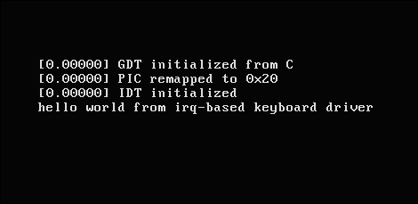
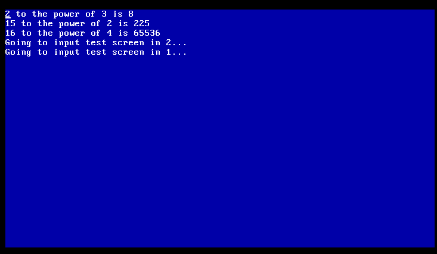
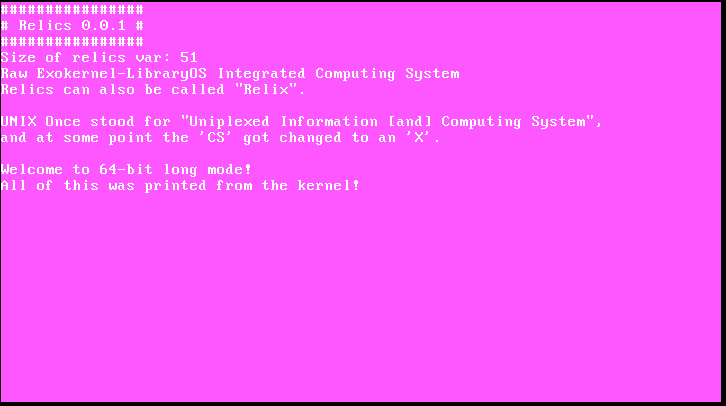
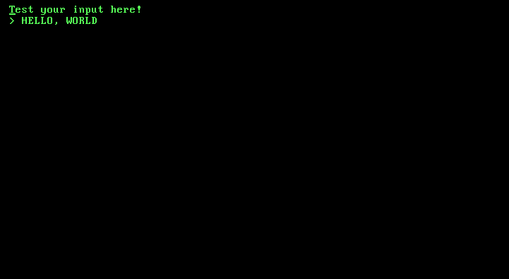

## relics
 Exokernel OS in C99. Made more of a proof of concept and hobby than anything.

- builds in 0.1 sec with a 16-thread Ryzen 5700G

download with:

``git clone https://github.com/Connor-GH/relics``

``cd relics``

compile with:

``make``

# Mandatory Dependencies:
- clang/gcc
- gmake
- QEMU-x86_64

Fair warning: use either the lld, gold, or mold linker.
The BFD linker works, but is not ideal.
